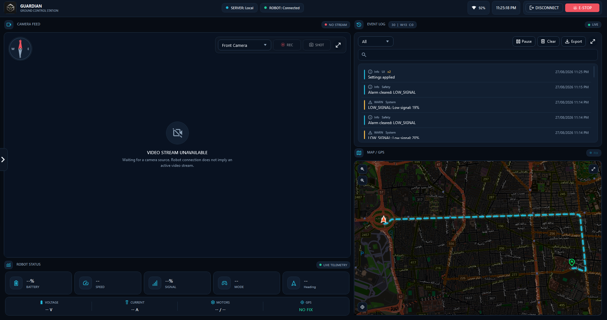
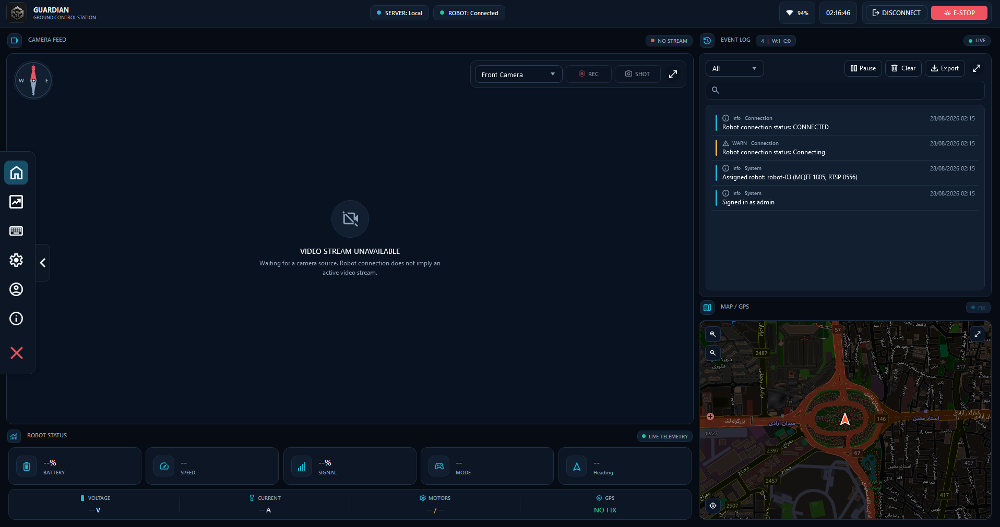
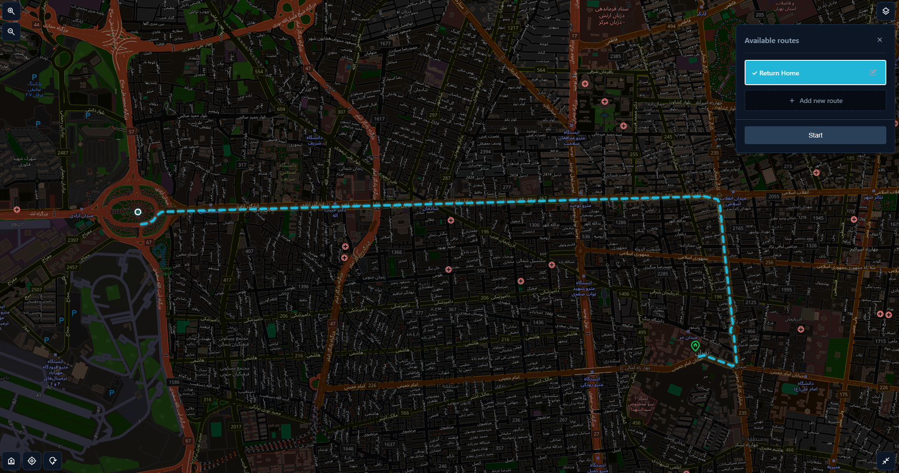
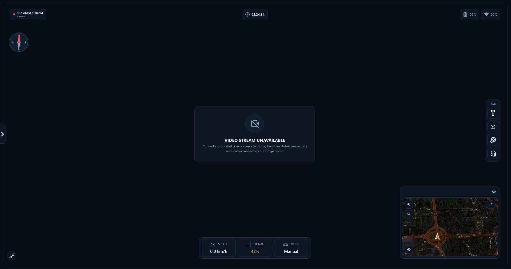
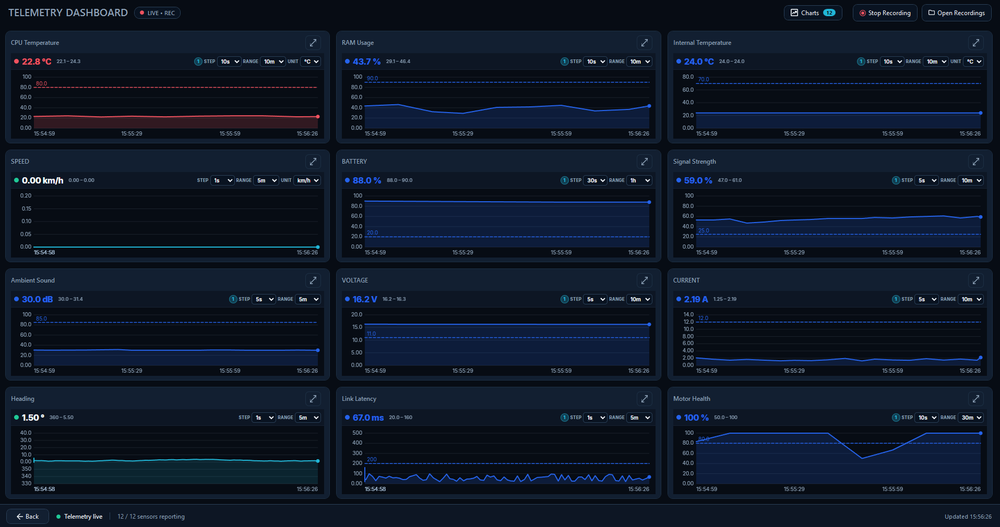
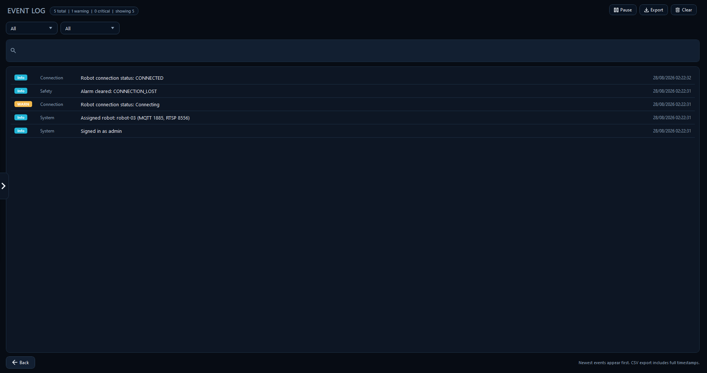
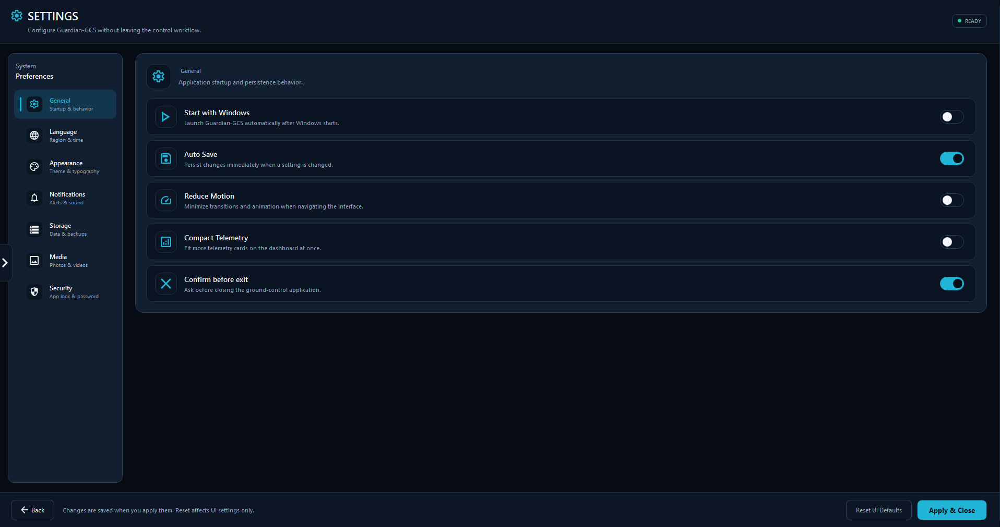

# Guardian GCS 0.1.1-beta

**A modern Windows Ground Control Station for monitoring, controlling, and managing robotic systems.**

[-informational)](#localization)

## Overview

Guardian GCS is a WPF desktop application for Windows that consolidates live telemetry, mapping, camera monitoring, teleoperation, event logging, and system configuration into a single operator console. It is designed for teams that need a reliable, professional interface to supervise and command a remote robotic platform.

The application ships with complete **English and Persian** localization, including native right-to-left layout support, making it suitable for international and regional deployments alike.

> **Beta notice.** This release includes a fully functional built-in simulator, allowing every panel of the interface to be evaluated without physical hardware. The architecture already defines the interfaces required for a live TCP/UDP/serial robot connection; this transport layer is under active development and not yet available. See [Project Status](#project-status) for details.

## Table of Contents

- [Overview](#overview)
- [Features](#features)
- [Screenshots](#screenshots)
- [Installation](#installation)
- [Requirements](#requirements)
- [Project Status](#project-status)
- [Localization](#localization)
- [Security Notice](#security-notice)
- [Source Code Availability](#source-code-availability)
- [Support and Issue Reporting](#support-and-issue-reporting)
- [License](#license)

## Features

| Category          | Capabilities                                                                                                              |
|-------------------|---------------------------------------------------------------------------------------------------------------------------|
| **Dashboard**     | Battery, speed, signal, mode, depth, voltage, current, motor and GPS status, emergency stop, safety reset                 |
| **Mapping**       | WebView2-based map with robot, home, and route tracking; dedicated fullscreen view                                        |
| **Camera**        | Live video feed with snapshot, recording, and fullscreen support                                                          |
| **Telemetry**     | Live recording, replay, and expandable data charts                                                                        |
| **Event Log**     | Full-text search, severity filtering, export, and notification prioritization                                             |
| **Teleoperation** | Configurable keyboard and gamepad bindings, drive-arm mode, hold-to-drive, deadzone and turn-scale tuning, gimbal control |
| **Safety**        | Hold-to-drive interlock, automatic stop on disconnect, motion lock while configuration panels are open                    |
| **Security**      | Optional application lock, password management, and session control                                                       |
| **Customization** | Dark, Light, Glass, and High Contrast themes; adjustable fonts and sounds; configurable storage paths and backup/restore  |
| **Localization**  | English (`en-US`) and Persian (`fa-IR`) included; additional language packs auto-discovered at runtime                    |
| **Simulation**    | Built-in `FakeRobotConnection` / `FakeServerConnection` for full offline evaluation                                       |

## Screenshots

| Live dashboard | Map panel |
|----------------|-----------|
|  |  |

| Camera panel | Telemetry charts |
|--------------|------------------|
|  |  |

| Event log | Settings and themes |
|-----------|---------------------|
|  |  |

## Installation

| Release | File | Platform | Size |
|---------|------|----------|------|
| [v0.1.1-beta](https://github.com/ab-mohammadi/Guardian-GCS/releases/tag/v0.1.2-beta) *(latest)* | [Download Guardian GCS v0.1.2-beta](https://github.com/ab-mohammadi/Guardian-GCS/releases/download/v0.1.2-beta/Guardian_GCS_Setup_0.1.2-beta_x64.exe) | Windows 10 / 11 (x64) | 7.28 MB |                                                                                

All current and past builds are available on the [Releases](https://github.com/ab-mohammadi/Guardian-GCS/releases) page.

### Setup steps
1. Download the installer from the table above.
2. Run the installer and follow the setup wizard.
3. Launch Guardian GCS. The application starts in **Demo Mode**, connected to the built-in simulator, so every panel is immediately usable.
4. Open **Settings → Language & Region** to switch between English and Persian at any time.

## Requirements

- Windows 10 or Windows 11 (x64)
- .NET Framework 4.7.2 (included in current Windows updates)
- A display driver with WebView2 support (installed automatically if not already present)

## Project Status

Guardian GCS v0.1.1 is an early public beta focused on the operator interface and offline evaluation experience. A new optional **Network (TCP)** transport layer for live robot and server connections has been added while keeping the built-in simulator as the default.

| Available now | Planned |
|---------------|---------|
| Full interface in Demo Mode + optional live Network transport | Production-grade TLS/encrypted server auth |
| Local installation and bilingual UI | Code-signed installer |
| Themes, teleoperation bindings, event log, telemetry replay | Autonomous mission execution (scaffolding only) |
| Fullscreen map, camera, and UI polish | MQTT / RTSP live paths fully wired |

## Localization

Guardian GCS supports full UI localization out of the box:

- `en-US` — English  
- `fa-IR` — Persian, including native right-to-left layout

Additional languages can be added by dropping a `Languages/<culture>.json` file into the application directory; new packs are automatically detected at startup.

## Security Notice

The current installer is not yet code-signed. As a result, Windows SmartScreen may display an "unrecognized app" warning on first run. If the source is trusted, select **More info → Run anyway** to proceed. Code signing is planned for an upcoming release.

**Pre-release warning.** The Network transport uses plaintext authentication. Use only on trusted networks or with additional security layers.

## Source Code Availability

This repository currently distributes pre-built Windows installers and supporting documentation. The application source is not public while the project is under active development. Bug reports and feature requests are welcomed and tracked through [Issues](https://github.com/ab-mohammadi/Guardian-GCS/issues).

## Support and Issue Reporting

To report a problem, please open an [issue](https://github.com/ab-mohammadi/Guardian-GCS/issues) and include:

- Steps to reproduce the issue
- Expected behavior vs. observed behavior
- Windows version
- Whether Demo Mode or a live connection was in use

## License

This project is distributed under the [MIT License](LICENSE).

© 2026 Guardian GCS. All rights reserved.
