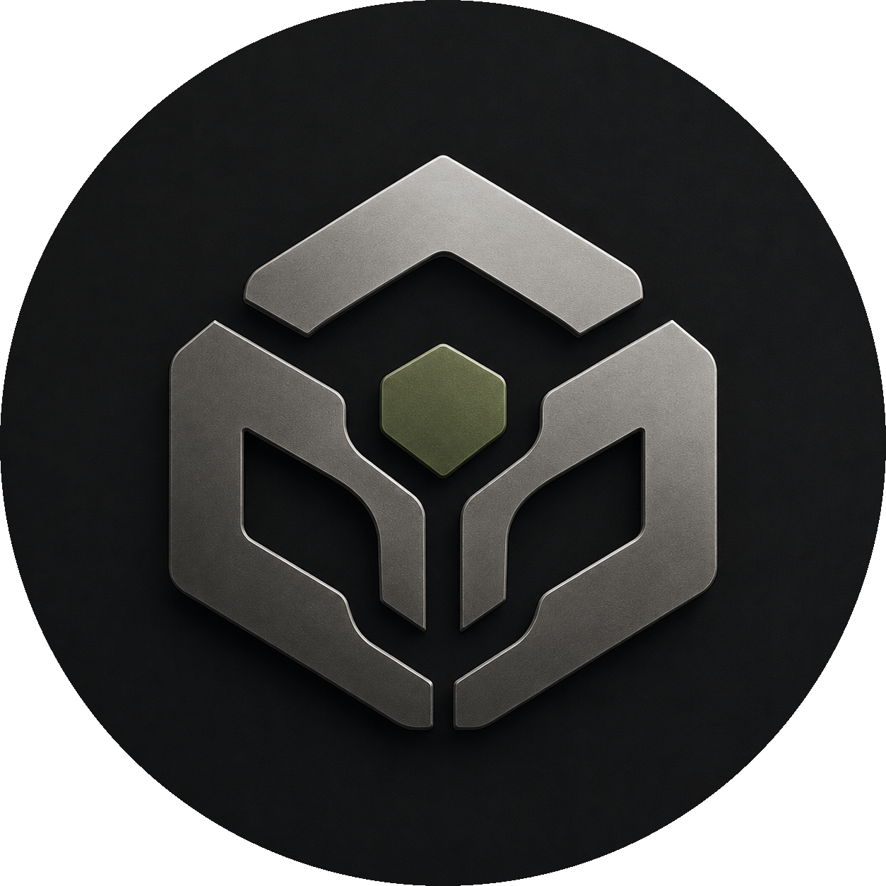

  

<h1 align="center">Guardian GCS</h1>

  A modern Windows Ground Control Station for monitoring, controlling, and managing robotic systems.

  
  
  
  
  

  

## Contents

- [About](#about)
- [Download](#download)
- [Screenshots](#screenshots)
- [Features](#features)
- [Requirements](#requirements)
- [Status & roadmap](#status--roadmap)
- [Source availability](#source-availability)
- [Reporting issues](#reporting-issues)
- [License](#license)

## About

Guardian GCS is a WPF desktop application that puts live telemetry, a map, a camera feed, teleoperation, event logging, and settings into a single operator window — built for supervising a remote robot from a Windows PC.

The interface is fully bilingual: **English** and **Persian**, including right-to-left layout, are supported out of the box.

This public beta ships with a built-in simulator, so the entire interface — dashboard, map, camera, telemetry, teleop — can be explored without any physical robot. The connection interfaces for a real TCP / UDP / serial transport already exist in the app but are **not implemented yet**; see [Status & roadmap](#status--roadmap).

## Download

| Version | Asset | Platform | Size |
|---|---|---|---|
| [v0.1.0-beta](https://github.com/a-mohamadi/Guardian-GCS/releases/tag/v0.1.0-beta) (latest) | [Guardian_GCS.Setup.v0.1.0.beta.exe](https://github.com/a-mohamadi/Guardian-GCS/releases/download/v0.1.0-beta/Guardian_GCS.Setup.v0.1.0.beta.exe) | Windows 10 / 11 (x64) | ~11.2 MB |

All builds, past and present, are published on the [Releases](https://github.com/a-mohamadi/Guardian-GCS/releases) page.

> **Note on the installer:** the .exe is not yet code-signed, so Windows SmartScreen may show an "unrecognized app" warning on first run. If you trust the source, choose **More info → Run anyway**. Signing is planned for a future release.

### Quick start

1. Download the installer from the table above.
2. Run it and follow the setup wizard.
3. Launch Guardian GCS — it starts in **Demo Mode** by default, connected to the built-in simulator, so you can try every panel immediately.
4. Open **Settings → Language & Region** to switch between English and Persian at any time.

## Screenshots

| | |
|---|---|
|  |  |
|  |  |
|  |  |

## Features

- **Dashboard** — battery, speed, signal, mode, depth, voltage, current, motor and GPS status, emergency stop, and safety reset
- **Map** — WebView2 map with robot / home / route state, plus a fullscreen view
- **Camera** — live feed with snapshot, recording, and fullscreen
- **Telemetry** — record, replay, and expandable charts
- **Event log** — search, severity filter, export, and notification priority
- **Teleoperation** — keyboard and gamepad bindings, drive-arm, hold-to-drive, deadzone, turn scale, and gimbal keys
- **Safety** — hold-to-drive, stop-on-disconnect, motion lock while panels are open
- **Security** — optional app lock, password change, and session management
- **Settings** — language and region, theme, fonts, sounds, storage paths, backup and restore
- **Localization** — `en-US` and `fa-IR`, with additional `Languages/<culture>.json` packs discovered at runtime
- **Themes** — Dark, Light, Glass, High Contrast
- **Demo mode** — `FakeRobotConnection` / `FakeServerConnection` so the full UI runs without hardware

## Requirements

- Windows 10 or Windows 11 (x64)
- .NET Framework 4.7.2 (already included with current Windows updates)
- A GPU/driver that supports WebView2 (used for the map and charts — installed automatically if missing)

## Status & roadmap

**v0.1.0** is an early public beta focused on the operator UI and demo experience.

| Ready | Not ready yet |
|---|---|
| Full UI in Demo Mode | Real robot transport (TCP / UDP / serial) |
| Local install and bilingual UI (English / Persian) | Production-grade server connectivity |
| Themes, teleop bindings, event log, telemetry replay | Code-signed installer |

Planned next: finishing the live robot transport, hardening server connectivity, and signing the installer.

## Source availability

This repository currently distributes **pre-built Windows installers and documentation only** — the application source is not public while it's under active development. Feature requests and bug reports are still very welcome through [Issues](https://github.com/a-mohamadi/Guardian-GCS/issues).

## Reporting issues

Open an [issue](https://github.com/a-mohamadi/Guardian-GCS/issues) and include:

- Steps to reproduce
- Expected vs. actual behavior
- Windows version
- Whether you were in Demo Mode or using a real connection

## License

Distributed under the [MIT License](https://github.com/a-mohamadi/Guardian-GCS/blob/main/LICENSE).
